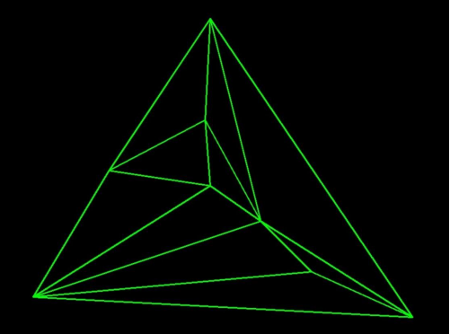
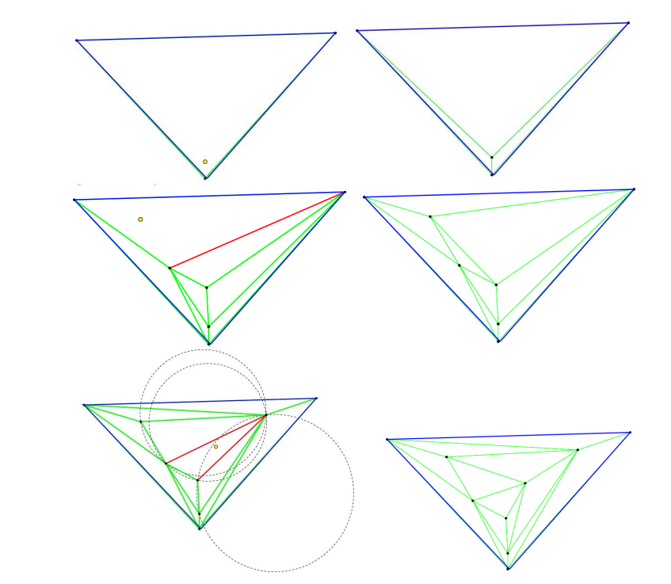

# Проект - "Построение триангуляции Делоне"
## Цели работы:
1. Создание библиотеки delaunayTriangulation, которая:
   - Строит триангуляцию, удовлетворяющую условию Делоне, по заданному множеству точек.
   - Визуализирует построенную триангуляцию при помощи OpenCV, а также генерирует tex-файл, который содержит в себе необходимую информацию для визуализации основных шагов алгоритма.
2. Создание тестового консольного приложения для тестирования и демонстрации работы библиотеки.

## Реализуемый алгоритм: алгоритм Боуэра-Ватсона https://ru.wikipedia.org/wiki/Алгоритм_Боуэра_—_Ватсона

---
## Описание библиотеки delaunayTriangulation.
1. Для чего: Библиотека delaunayTriangulation содержит набор функций и структур, необходимых для реализации алгоритма Боуэра-Ватсона построения триангуляции Делоне. Соответственно она может быть использована в сторонних библиотеках для решения задач, требующих построения триангуляции.
2. Использование функционала: все функции и структуры библиотеки находятся внутри пространства имён delaunay.
Алгоритм Боуэра-Ватсона реализован в функции getTriangulation():
```c++
/**
	@brief Реализация алгоритма Боуэра-Ватсона.

	@param points Входной набор точек
	@param fout Поток для вывода в tex-файл информации для визуализации шагов алгоритма
	@return Вектор треугольников, входящих в триангуляцию
	*/
std::vector<Triangle> getTriangulation(std::vector<Point>& points, std::ofstream& fout);
```
## Описание тестового приложения 
Представляет собой консольное приложение, принимающее параметры командной строки: 
- путь до тестового файла
- путь к tex-файлу, куда будет записана информация для визуализации шагов алгоритма в LaTeX 
  
	Если не передать второй параметр, запись будет производиться в файл по умолчанию, который находится в папке results.
В папке проекта в разделе tests можно найти примеры тестовых файлов, на которых есть возможность протестировать работу библиотеки. Формат тестовых файлов выглядит следующим образом: в первой строке одно натуральное число N - количество точек входного набора. Далее идут N строк,
в каждой из которых пара положительных чисел, записанных через пробел
координаты точки. \
__При несоответствии тестового файла описанному выше
формату корректная работа тестового приложения не гарантирована__!

## Результаты работы библиотеки:




---
## Инструкция по сборке
### Требования: для установки и тестирования библиотеки delaunayTriangulation, необходимо предварительно установить с помощью vcpkg библиотеку OpenCV. Также на компьютере должна быть установлена система генерации документации Doxygen.
### Инструкция:
1. Cкачать исходный код проекта
2. Перейти в командной строке в корневую папку проекта
3. Создать папку build с помощью команды mkdir build и перейти в нее: cd build
4. Далее ввести следующие команды:
   - *cmake -DCMAKE_TOOLCHAIN_FILE = ”путь до vcpkg.cmake” ..*
   - *cmake --build . --config Release*
   - *cmake --install . --config Release --prefix "путь до папки, куда инсталлировать библиотеку"*

## Инструкция по тестированию
Для тестирования работы библиотеки предложены тестовые файлы, находящиеся в папке goncharovskiy_m_n\prj.cw\tests. Данная папка инсталлируется вместе с библиотекой.
1. Для тестирования библиотеки перейдите в папку, куда была инсталлирована библиотека
2. Перейдите в папку bin, содержащую исполняемый файл тестового приложения delaunay_test.exe
3. В командной строке запустите тестовое приложение, передав в качестве аргументов командной строки путь к тестовому файлу, а также путь к файлу, куда будет записываться информация для визуализации 
алгоритма в LaTeX. Если не передать второй параметр, запись будет идти в файл по умолчанию, находящийся в папке results. Пример: \
	*delaunay_test.exe ..\tests\test1.txt*
4. После завершения выполнения тестового приложения, можно ознакомиться с результатами работы библиотеки в файле, который был указан в качестве второго параметра, или, если таковой не был передан, в 
папке results, в которой будет находиться tex-файл, с записанной информацией о шагах алгоритма.


